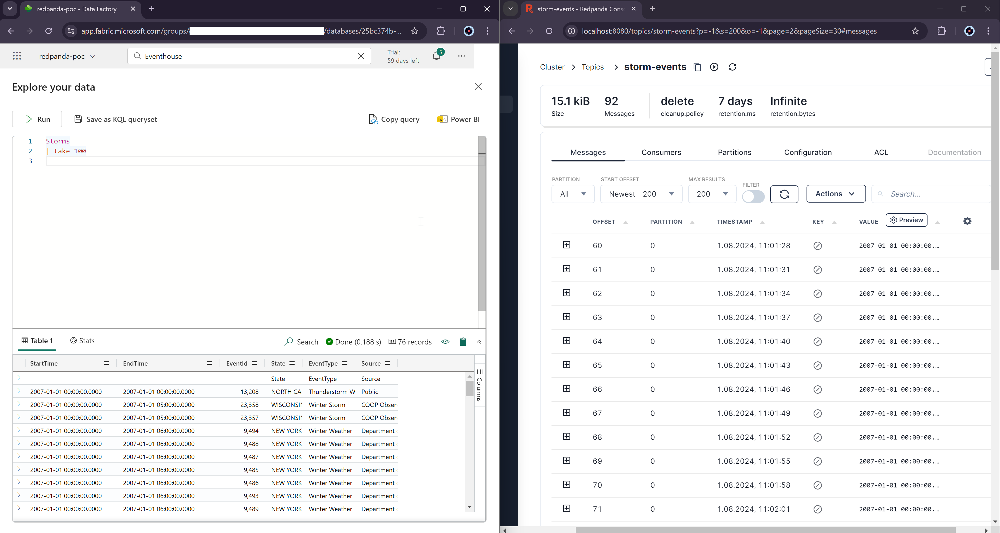

# Redpanda -> Microsoft Fabric integration

## Introduction
This project shows how to ingest data with Redpanda, using a self-contained Docker setup to simplify the Redpanda cluster and Redpanda connector cluster setup. Integration has been created based on official Microsoft documentation for Kafka: https://learn.microsoft.com/en-us/fabric/real-time-intelligence/get-data-kafka.

Flow:
1. Events producer sends data on Redpanda cluster on defined topic
2. Connector setup integration between Redpanda and Microsoft Fabric KQL database
3. Each new message on topic creates new entry on KQL database

## Prerequisites
* Linux system with docker and docker-compose installed
* Created KQL database on Microsoft Fabric - https://app.fabric.microsoft.com
    * For new users a 60 day trial can be used: https://learn.microsoft.com/en-us/fabric/get-started/fabric-trial
* The Microsoft Entra service principal. It can be created through the Azure portal or programmatically:
```
az login
az account set --subscription YOUR_SUBSCRIPTION_GUID
az ad sp create-for-rbac -n "redpanda-connector" --role Reader --scopes /subscriptions/{SubID}
```

## Setup
1. Setup Microsoft Fabric
    1. Go to https://app.fabric.microsoft.com/
    2. Create new Eventhouse
        * Go to `Real-Time Intelligence` page
        * Click Create, select Eventhouse and provide a meaningful name for it.
        

    3. Once Eventhouse is created, create a new KQL database
    

    4. Configure KQL database
        * For a new KQL database, open `Query data`
        

        * Run the following query. Please replace YOUR_APP_ID and YOUR_TENANT_ID with the Service Principals created earlier.
```
.create table Storms (StartTime: datetime, EndTime: datetime, EventId: int, State: string, EventType: string, Source: string)

.create table Storms ingestion csv mapping 'Storms_CSV_Mapping' '[{"Name":"StartTime","datatype":"datetime","Ordinal":0}, {"Name":"EndTime","datatype":"datetime","Ordinal":1},{"Name":"EventId","datatype":"int","Ordinal":2},{"Name":"State","datatype":"string","Ordinal":3},{"Name":"EventType","datatype":"string","Ordinal":4},{"Name":"Source","datatype":"string","Ordinal":5}]'

.alter table Storms policy ingestionbatching @'{"MaximumBatchingTimeSpan":"00:00:15", "MaximumNumberOfItems": 100, "MaximumRawDataSizeMB": 300}'

.add database YOUR_DATABASE_NAME admins  ('aadapp=YOUR_APP_ID;YOUR_TENANT_ID') 'AAD App'
```

2. Run the Redpanda cluster
```
docker-compose up -d
```
3. Go to Redpanda console http://localhost:8080/ and confirm that messages are present on the topic
4. Make a copy of `adx-sink-config-template.json` file to `adx-sink-config-template.json` and fill it with proper values:
    * Service principal information (AppId, Secret and TenantId)
    * Kusto URLs form Fabric (Ingestion and Query URL)
    * KQL database name
5. Start the connector
```
curl -X POST -H "Content-Type: application/json" --data @adx-sink-config.json http://localhost:8083/connectors

# To check the status of the connector
curl http://localhost:8083/connectors/storm/status
```
6. Go to Microsoft Fabric and check the table for this data:
```
Storms | take 100
```


## Links
* Lab source: https://learn.microsoft.com/en-us/fabric/real-time-intelligence/get-data-kafka
* Redpanda Self-Hosted Quickstart: https://docs.redpanda.com/current/get-started/quick-start/
* Redpanda connector: https://docs.redpanda.com/current/deploy/deployment-option/self-hosted/docker-image/
